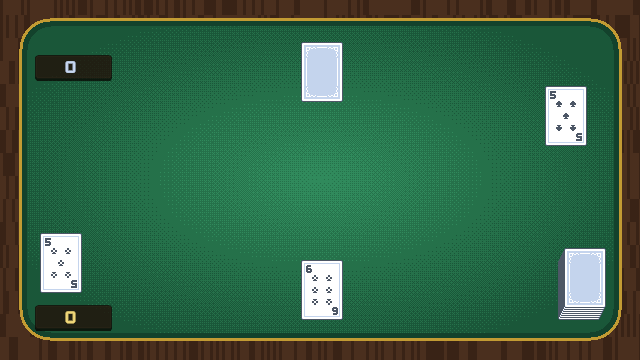
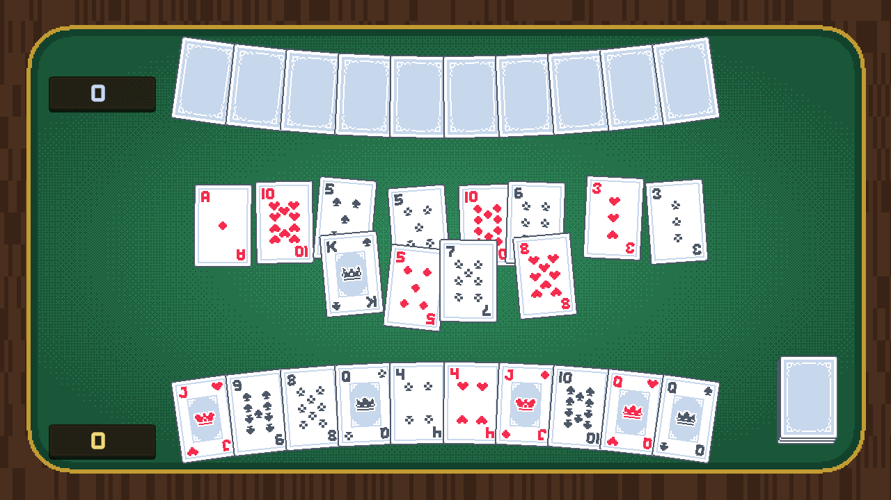
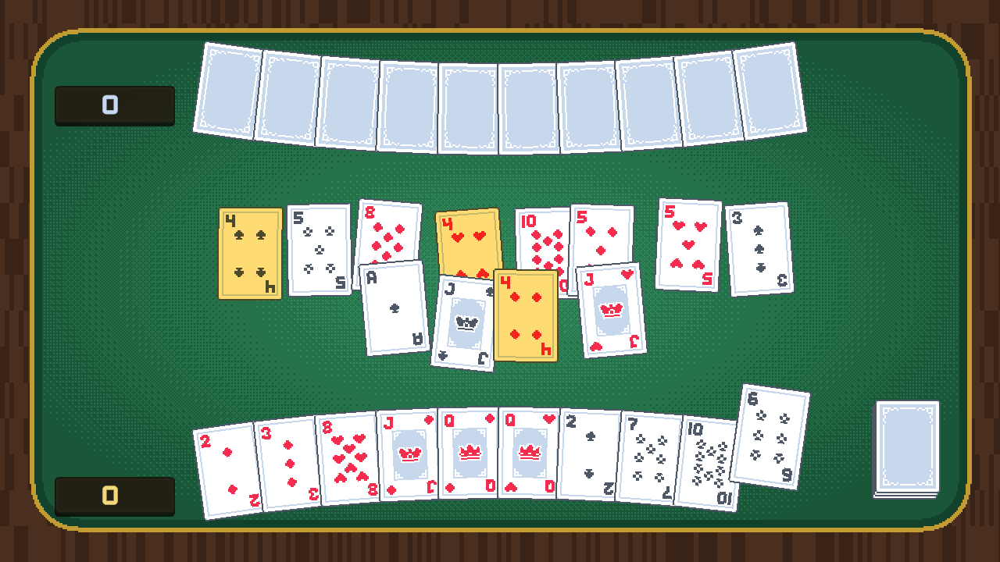
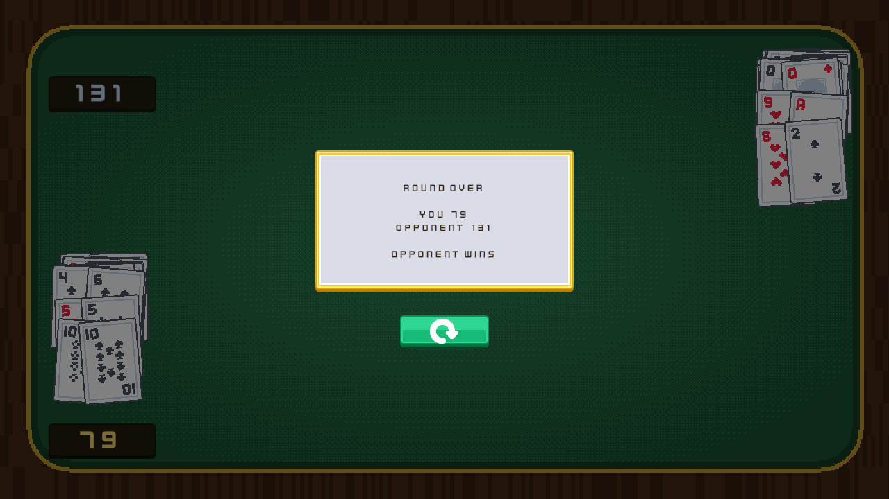

# 钓红点 · Whitefish-Deck

一副扑克牌就能玩的童年游戏,用 Unity 6 做成像素风的双人对局。

**凑十钓牌,只算红点。** 谁收走的红桃与方片分数高,谁就赢。



> 发牌 → 双方轮流出牌 → 凑十钓走 → 分数累加。上图为演示,双方均由 AI 驱动。



---

## 玩法

### 钓牌

手上的牌能和台面的牌**凑成 10**,就把这一对收走:

```
A 配 9    2 配 8    3 配 7    4 配 6    5 配 5
```

**10、J、Q、K 不参与凑十**,它们只和同点数的牌对碰:10 钓 10、J 钓 J、Q 钓 Q、K 钓 K。

选中一张手牌,台面上所有能钓的牌会亮起来:



> 图中手上的 6♣ 被选中,台面三张 4 同时亮起 —— 6 + 4 = 10。

### 一个回合

```
出一张手牌 ──能凑十/对碰──→ 钓走这一对
            └─凑不上──────→ 放一张到台面
                              ↓
                     从牌堆摸一张,同样判定一次
                              ↓
                            轮下家
```

每回合恰好消耗 **1 张手牌 + 1 张牌堆**,所以双方手牌和牌堆会同时见底 —— 发牌张数就是照这个配平的:

| 人数 | 每人手牌 | 台面翻开 | 剩余盖牌 |
|:---:|:---:|:---:|:---:|
| 2 人 | 10 | 12 | 20 |
| 3 人 | 7 | 10 | 21 |
| 4 人 | 5 | 12 | 20 |

三组都正好凑满 52 张。

### 计分

**只有红牌算分**,黑桃梅花收再多也是零:

| 牌 | 分 |
|:---:|:---:|
| A | 20 |
| 2 ~ 8 | 按面值 |
| 9、10、J、Q、K | 各 10 |

红牌满分 **210**。牌打完后亮出结算:



---

## 运行

用 **Unity 6000.5.5f1** 或更高版本打开工程,加载 `Assets/Scenes/PokerTable.unity`,按 Play。

对家由 AI 接管:优先钓分数最高的组合,钓不动时打出手上最不值钱的牌。

---

## 代码结构

分三层,依赖是单向的 —— 上层不知道下层的存在。

```
数据层    Card · Deck · CaptureRules · ScoreRules
            纯 C#,不引用 UnityEngine 之外的东西,可脱离场景验证
              ↓
表现层    CardView · CardZone(HandZone / TableZone / PileZone / SlotZone)
            Zone 决定"每张牌该在哪",CardView 只管长相与缓动
              ↓
规则层    PokerTable · PlayerSeat
            回合状态机、座位轮转、AI
```

几个刻意的设计:

- **牌不决定自己在哪。** `CardZone` 派发 `CardPose`(位置 / 旋转 / 层级),`CardView` 每帧缓动过去。换个 Zone 就自然飞过去,不需要过渡代码。
- **加玩家是场景操作。** `PokerTable` 持有座位列表,发牌与轮转都绕列表走。加第三、四位玩家只需在场景里多摆一副手牌和收牌堆。
- **输入只有一条链路。** 卡牌、台面空白、按钮都实现 `ICardPointerTarget`,由 `CardPointerInput` 统一按层级派发。没有 Canvas,也没有第二套输入系统。
- **不替玩家做决定。** 摸到的牌即使只有一个合法目标,也会等玩家点选。

---

## 素材

- 牌面与 UI:[Kenney](https://kenney.nl) 的 Playing Cards Pack 与 UI Pack(CC0)
- 字体:Kenney Future Narrow —— **只含拉丁字形**,所以游戏内文字是英文;要中文需另配字体资产
- 牌桌是程序化生成的([`Assets/Art/Table/table_surface.png`](Assets/Art/Table/table_surface.png)):木纹外框 + 金边 + Bayer 抖动的绒面渐晕,无外部依赖

## 尚未完成

- 跨局累计与对局历史
- AI 只看单步收益,不会避免给对手喂牌
- 3 / 4 人局的座位布局(规则与发牌张数已支持)
